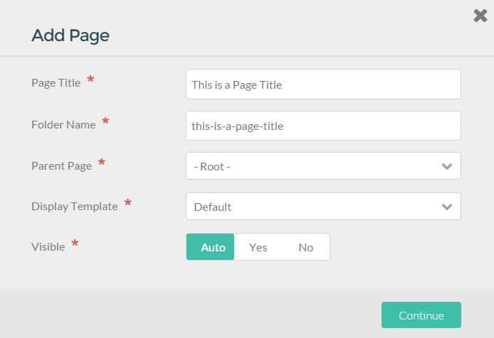

The **Pages** page gives you quick editorial access to your site's content. This is where you can access a page's editor, delete pages, create new pages, and find out if a page is visible at a glance.

If you frequently create or modify content on your site, this area of the admin will become very familiar to you.

## Adding New Pages

Three buttons line the top of the **Pages** administrative panel. The **Back** button sends you back to the **Dashboard**, while the **Add Page** and **Add Modular** buttons initiate the creation of new pages for your site.

Below, we break down the options available when you select these buttons.

### Add Page

The **Add Page** button creates a non-modular page for your site. Once selected, a popup will appear enabling you to enter a **Title** and **Folder Name**, assign a **Parent Page** and **Display Template**, as well as to set whether the page should be visible or hidden.

| Option           | Description                                                                                                                        |
| :-----           | :-----                                                                                                                             |
| Page Title       | This is where you enter the title of the page you are creating.                                                                    |
| Folder Name      | You can set a custom folder name for the page, or keep the automatically-generated one based on the title.                         |
| Parent Page      | This sets the parent page for the new page. Can be a child of another page (such as home or blog) or set to the root of your site. |
| Display Template | You can choose which theme-provided template you wish to have applied to the page.                                                 |
| Visible          | Sets whether or not you want the page to be visible in navigation. Can be set to **Auto** to have this be determined for you.      |

 