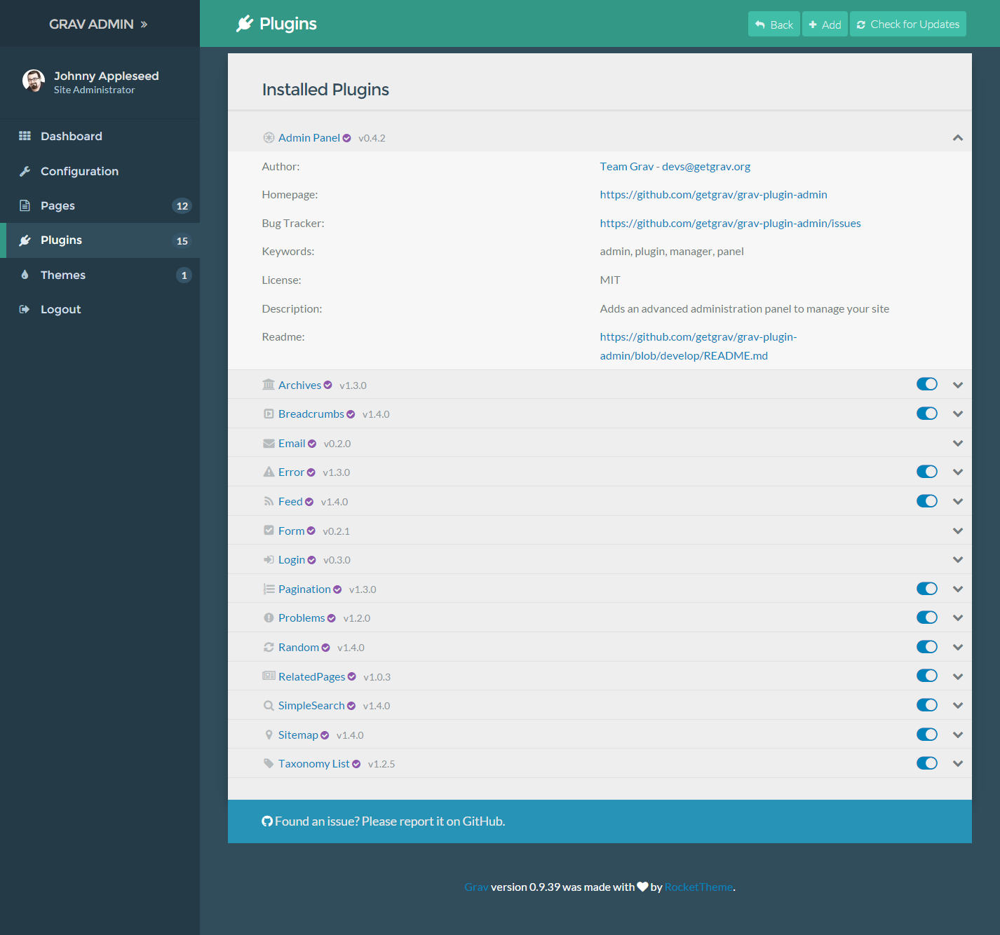
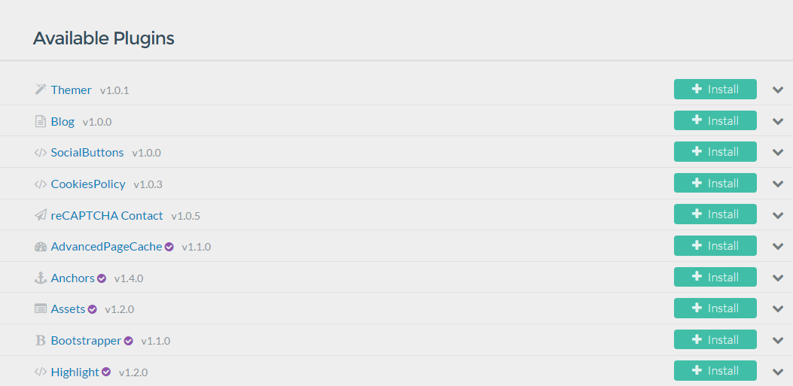
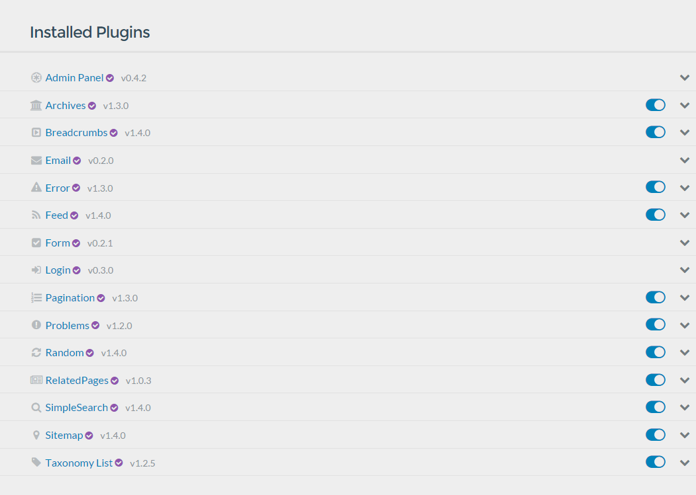
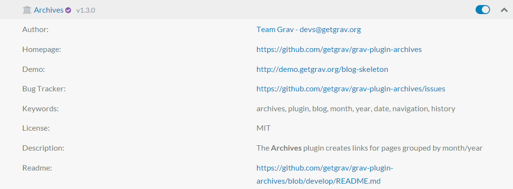

 

The **Plugins** in the admin is a powerful text editor and page manager that enables you to create your page's content (including media files), its publishing and taxonomy options, settings, overrides, and theme-specific options.

It's essentially a one-stop-shop for managing a specific page.

In this page, we will go over the features and functionality found in the **Advanced** tab of the **Plugins**. 

>>>>> You might notice the check boxes to the left of some of the options in this area of the admin. These boxes indicate that you would like to override the default values for this page. Leaving them unchecked reverts to blank or default states.

## Controls

The **Controls** area at the top of the page give you access to the ability to add new plugins, as well as check for updates for existing ones. 

The <i class="fa fa-plus"></i> Add button takes you to a page listing all of the currently-available Grav plugins, enabling you to view their information and install them by selecting the <i class="fa fa-plus"></i> Install button to the right of the plugin.

The <i class="fa fa-check-circle"></i> icon indicates that the plugin is created and supported by the Grav team. Plugins without this icon were created by third-party developers.

## Installed Plugins

This area of the Plugins administrator gives you the ability to see, at a glance, which plugins are presently installed on your Grav site. Additionally, you can enable and disable these plugins by selecting the <i class="fa fa-fw fa-toggle-on"></i> toggle icon to the right of each plugin.

Upon selecting the <i class="fa fa-chevron-down"></i> chevron icon will give you more information about the plugin, including its author, project home page and bug tracker, as well as its license and a brief description. You can also quickly access the plugin's readme file for additional information and usage guide.