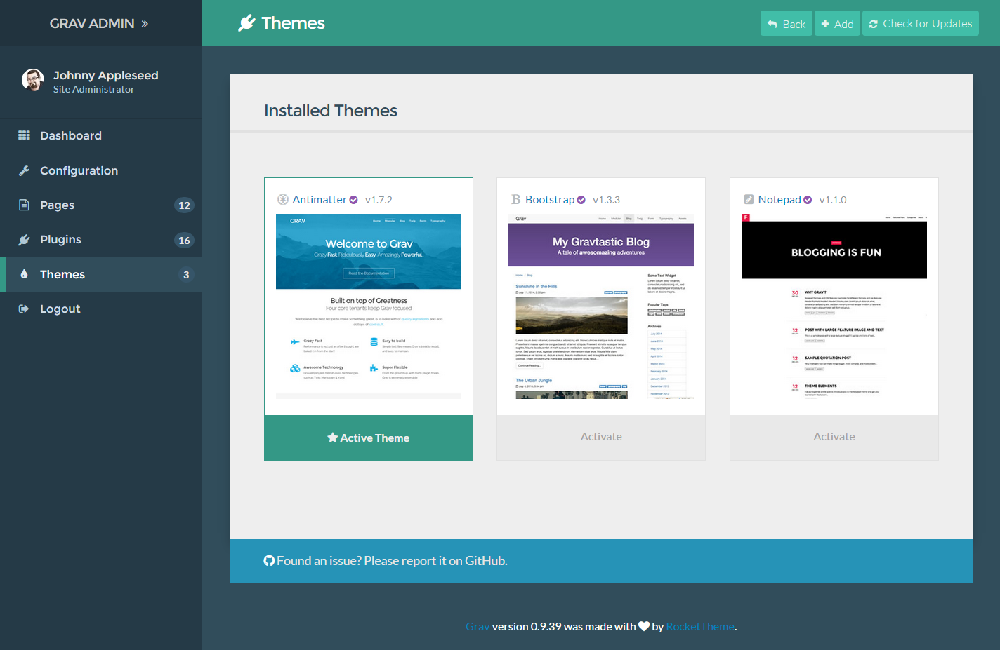
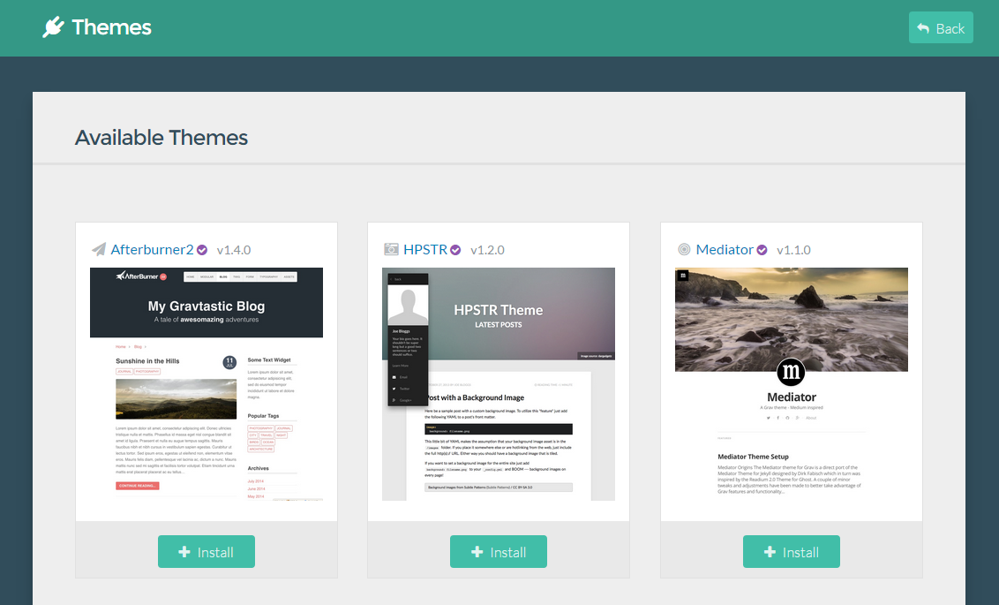
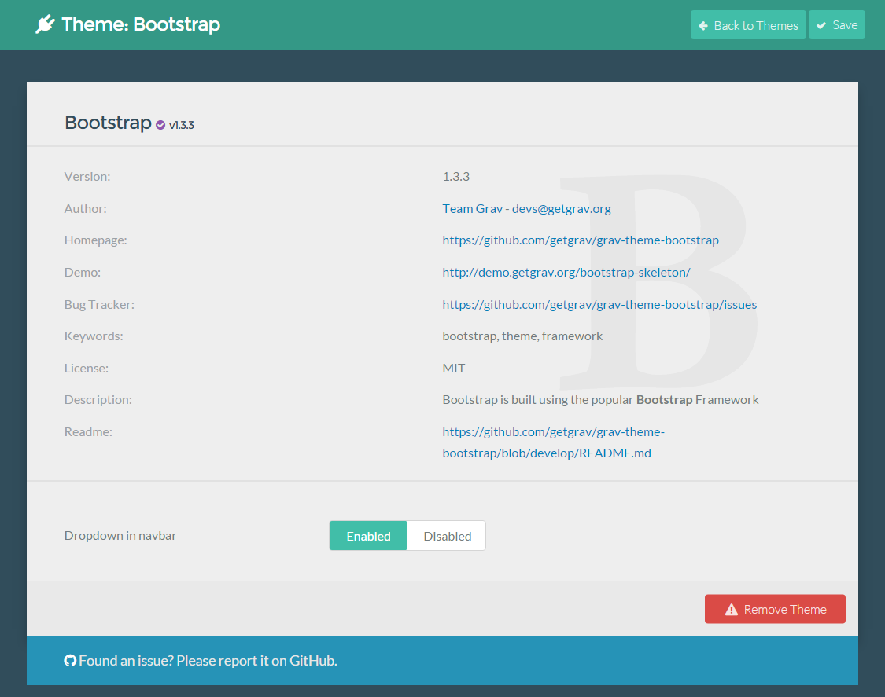

 

The **Themes** in the admin is where you can go to add and manage your site's themes.

In this page, we will explore how to manage existing themes, and add a new one to your site.

## Controls

### Adding a New Theme

## Installed Themes

